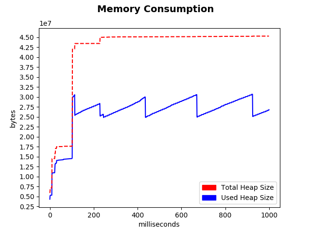

## Memory Consumption Benchmarking Tool

### Setup

It is recommended that *virtualenv* is used when installing necessary dependencies. All python dependencies are listed in the requirements.txt file located in the root directory. Note this package is meant to run using Python 2.7. To install all dependencies execute:

```bash
pip install --upgrade pip # may need to upgrade pip first (optional)
pip install -r requirements.txt 
```

For some reason, a few of the key functionalities of the script are not supported or properly handled by the most recent version of chrome-driver. It's possible this could change, but so far the only known version of chrome-driver compatible with this script is **2.26**, which can be found [here](https://chromedriver.storage.googleapis.com/index.html?path=2.26/).

The chrome-driver executable must be added to your PATH. The Chrome browser must also be installed included in PATH.

### Running the tool

In the root directory there is a selenium powered python script named metrics.py. This script takes an input of either a URL or a path to local web page file (absolute or relative). It then loads the page in a new instance of Chrome and computes the time it took to load. 

After the page finishes loading, the instance of Chrome is killed a new one is spawned, this time with a Chrome extension named *metricExtension* enabled. The extension is included in the repo.  This extension allows the script to analyze the windows heap status. After all the heap data is gathered by the script the memory consumption as a function of time is generated and displayed to the user

If the script receives no input it defaults to google.com. When passing in a local path, prefix the input with "-f" or "--file_path". When passing in a URL, pass the prefix "-u" or "--url".

After the tool finishes performing its analysis, it generates a presents a graph of the memory consumption overtime. The graph is generated using *matplotlib*. This graph image is saved as "graph.png" in whatever directory the script was run from.

#### metrics.py Examples

##### example inputs

```
python metrics.py --url https://google.com
```

```
python metrics.py --file_path ./index.html
```

##### example output



### Chrome Extension Details

Google Chrome (and only Google Chrome) provides a JavaScript object called *window.performance.memory* which contains info on the current status of the windows heap. More details can be found [here](https://webplatform.github.io/docs/apis/timing/properties/memory/). The chrome extension uses this to gather heap data statics over a set period of time. 

In order to access the *window* object, a script must be embedded in the web page. The chrome uses a content script to embed a script at the very top of the target web page so so that it is executed before anything else on the page. The embedded script then uses the *Interval* function to intermittently (every millisecond) execute a short function in the background while the rest of the page loads. The function prints the current heap status to the console.

As the heap data is printed to the console, the selenium powered python script collects the data by reading from the console. After the embedded js finishes outputting heap data, it prints out a final "done!" message which informs the python script that there is no more data to read. With all the data gathered, the python script then begins producing the graph.

There isn't a reliable way of knowing when the JavaScript on a page finishes loading, so for no the script just monitors the heap status for five seconds. This is indicated in the embedded script by the initial interval count being set to 5000. This can be adjusted, but be sure to repackage the extension after making any changes.


